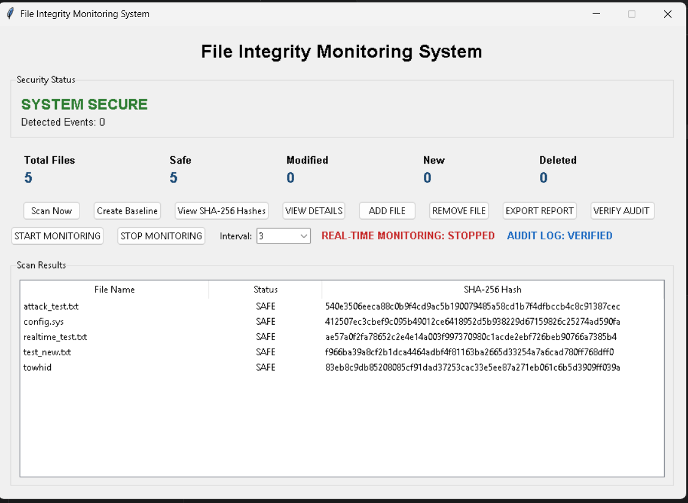
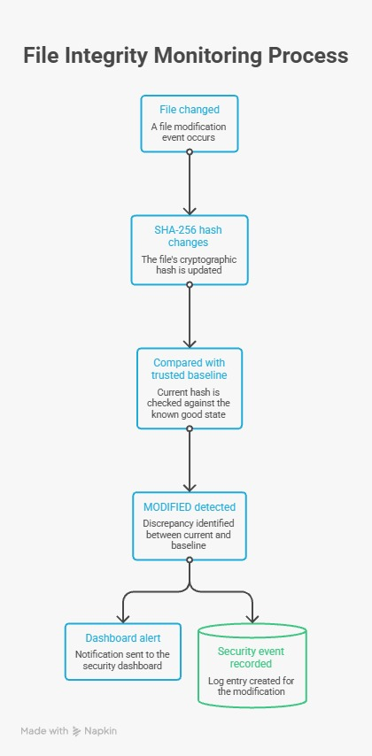
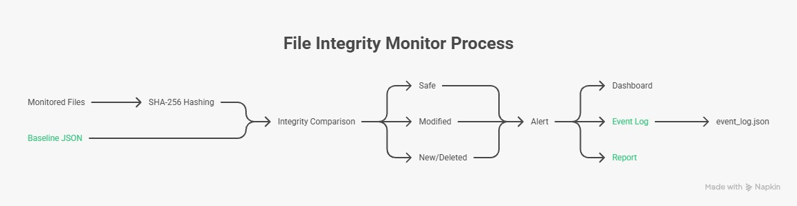

# 🔐 File Integrity Monitoring System Using SHA-256

A Python-based File Integrity Monitoring (FIM) system designed to detect unauthorized changes to important files using SHA-256 cryptographic hashing.

## 📌 Project Overview

Our project is a security system that continuously monitors important files, calculates their SHA-256 hashes, compares them with a trusted baseline, and automatically detects unauthorized modifications, new files, and deleted files.

The system provides a graphical dashboard, real-time filesystem monitoring, security event logging, tamper-evident audit logging, SHA-256 comparison, and security report generation.

## 🎯 Objectives

- Detect unauthorized file modifications
- Detect newly created files
- Detect deleted files
- Verify file integrity using SHA-256
- Create and maintain a trusted baseline
- Provide real-time filesystem monitoring
- Maintain a security event log
- Detect tampering with the audit log
- Generate security reports

## 🚀 Main Features

### 1. SHA-256 File Integrity Checking

The system calculates the SHA-256 hash of monitored files and compares the current hash with the trusted baseline.

If a file is modified, its SHA-256 hash changes and the system detects the modification.

### 2. Trusted Baseline

The system creates a trusted baseline containing the SHA-256 hashes of monitored files.

The baseline is stored in:

`baseline.json`

### 3. File Change Detection

The system detects four major states:

| Status | Meaning |
|---|---|
| SAFE | File hash matches the trusted baseline |
| MODIFIED | Existing file hash has changed |
| NEW | File is not present in the trusted baseline |
| DELETED | A baseline file no longer exists |

### 4. Real-Time Monitoring

The project uses the Watchdog library to monitor the `monitored_files` directory.

It can detect:

- File creation
- File modification
- File deletion
- File movement or renaming

### 5. Graphical User Interface

The GUI is developed using Python Tkinter.

The dashboard provides:

- Security status
- File status table
- SHA-256 hashes
- Create Baseline
- Scan Now
- Add File
- Remove File
- View Details
- Start Monitoring
- Stop Monitoring
- Security Event Log
- Verify Audit Log
- Export Report

### 6. Security Event Logging

Security-related events are stored with timestamps in:

`event_log.json`

Examples include:

- MODIFIED
- NEW FILE
- DELETED
- BASELINE CREATED
- MONITORING STARTED
- MONITORING STOPPED

### 7. Tamper-Evident Audit Log

The audit log uses a SHA-256 hash chain.

Each event contains:

- timestamp
- event type
- message
- previous hash
- event hash

Each event is linked to the previous event. If someone changes an existing audit record, the system can detect that the chain has been broken.

### 8. File Details

The View Details feature shows:

- File name
- Current status
- Original SHA-256 hash
- Current SHA-256 hash
- Integrity comparison result

### 9. Security Report Export

The system can export a security report containing:

- Security summary
- File inventory
- SHA-256 hashes
- Detected changes
- Audit events
- Audit verification status

## 🏗️ Project Structure

```text
FileIntegrityMonitor/
│
├── monitored_files/
│
├── tests/
│   ├── test_fim_engine.py
│   └── test_gui_logging.py
│
├── fim.py
├── fim_engine.py
├── gui.py
├── main.py
│
├── baseline.json
├── event_log.json
├── .gitignore
└── README.md
## 📸 Project Interface

### File Integrity Monitoring Dashboard



### System Architecture



### Monitoring Process


